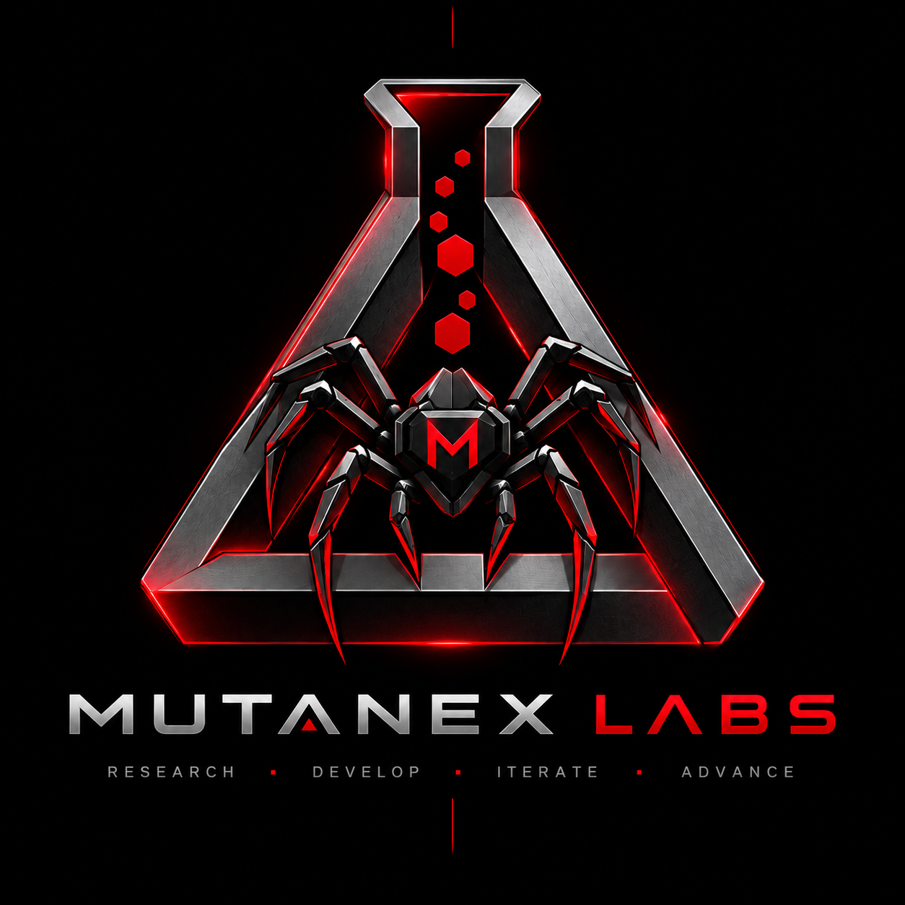

  

  <b>Research · Develop · Iterate · Advance</b>

# Mutanex Labs

**Independent research and engineering lab exploring what can be built beyond the obvious.**

Mutanex Labs brings together research, experimentation and engineering. It is a place for projects that explore new approaches, challenge established solutions or turn unusual ideas into working technology.

The scope is intentionally broad: **algorithms and mathematics, systems software, runtimes, networking, distributed systems, performance engineering, AI, developer infrastructure and experimental software.**

Some work begins with a mathematical question. Some starts with an engineering problem that needs a different approach. Some grows into complete software, infrastructure or an independent technology.

### Research

Algorithms, computational methods, applied mathematics and experimental approaches to problems where the interesting part is still unknown.

### Engineering

Systems and software built around new architectures, unusual constraints or ideas that need more than a conventional implementation.

### Technology

Tools, infrastructure and larger projects that turn research and engineering into something that can actually be used.

Not every experiment becomes a project, and not every project begins as research. Mutanex Labs exists for the space between the two.

  <b>Build what doesn't exist yet.</b>

---

# Mutanex Labs · RU

**Независимая исследовательская и инженерная лаборатория, где мы пробуем создавать то, для чего ещё нет очевидного решения.**

Mutanex Labs объединяет исследования, эксперименты и разработку. Здесь появляются проекты, в которых хочется проверить новый подход, выйти за рамки существующих решений или превратить необычную идею в работающую технологию.

Направления не ограничены одной областью: **алгоритмы и математика, системное программирование, среды исполнения, сети, распределённые системы, производительность, искусственный интеллект, инфраструктура разработки и экспериментальное ПО.**

Что-то начинается с математического вопроса. Что-то — с инженерной задачи, для которой существующие решения не подходят. А отдельные идеи постепенно превращаются в полноценные программы, инфраструктуру или самостоятельные технологии.

### Исследования

Алгоритмы, вычислительные методы, прикладная математика и экспериментальные подходы к задачам, в которых самое интересное ещё только предстоит найти.

### Разработка

Системы и программное обеспечение, построенные вокруг новых архитектур, необычных ограничений или идей, которым недостаточно стандартной реализации.

### Технологии

Инструменты, инфраструктура и более крупные проекты, в которых исследования и инженерия превращаются в то, чем уже можно пользоваться.

Не каждый эксперимент становится проектом, и не каждый проект начинается с исследования. Mutanex Labs существует как раз на пересечении этих вещей.

  <b>Создавать то, чего ещё нет.</b>

